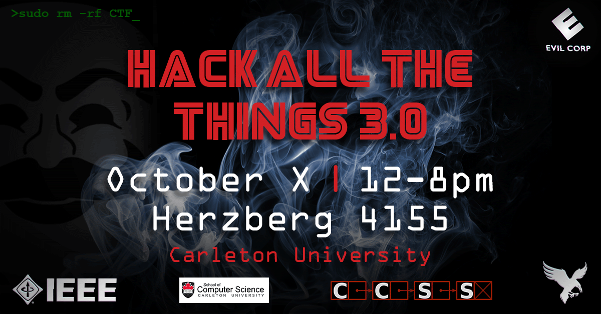

# Hack All The Things Round 3.0
## crypto
[So Two Thousand and Late | 30](https://github.com/h4tt/H4TT-3.0/tree/master/crypto/2000_and_late)

[Token for your Thoughts | 40](https://github.com/h4tt/H4TT-3.0/tree/master/crypto/token_for_your_thoughts)

[Boxed Salad | 50](https://github.com/h4tt/H4TT-3.0/tree/master/crypto/boxed_salad)

[Split The Atom | 50](https://github.com/h4tt/H4TT-3.0/tree/master/crypto/split_the_atom)

## misc
[Racing the Beam | 40](https://github.com/h4tt/H4TT-3.0/tree/master/misc/racing_the_beam)

## pwn
[Talk To Me (Part 1) | 60](https://github.com/h4tt/H4TT-3.0/tree/master/pwn/talk_to_me)

[You Can Drown in Just 64 Bytes of Data (Part 2) | 65](https://github.com/h4tt/H4TT-3.0/tree/master/pwn/you_can_drown_in_just_64_bytes_of_data)

## recon
[And Then it Went Viral | 40](https://github.com/h4tt/H4TT-3.0/tree/master/recon/it_went_viral)

## rev
[maybe_crypto | 50](https://github.com/h4tt/H4TT-3.0/tree/master/rev/maybe_crypto)

## stego
[Eye of the Parser | 120](https://github.com/h4tt/H4TT-3.0/tree/master/stego/eye_of_the_parser)

## web
[Not The Bots You Are Looking For | 50](https://github.com/h4tt/H4TT-3.0/tree/master/web/not_the_bots_you_are_looking_for)

[For the Love of Codd | 70](https://github.com/h4tt/H4TT-3.0/tree/master/web/for_the_love_of_codd)

