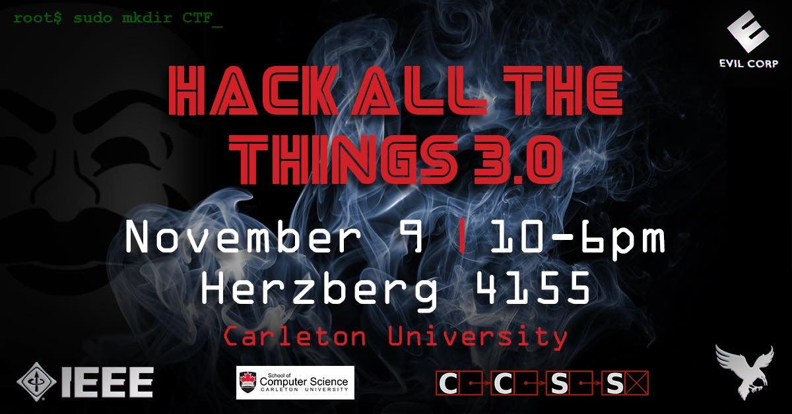

# Hack All The Things Round 3.0
## crypto
[So Two Thousand and Late | 30](https://github.com/h4tt/H4TT-3.0/tree/master/crypto/2000_and_late)

[Token for your Thoughts | 40](https://github.com/h4tt/H4TT-3.0/tree/master/crypto/token_for_your_thoughts)

[Boxed Salad | 50](https://github.com/h4tt/H4TT-3.0/tree/master/crypto/boxed_salad)

[Hog | 50](https://github.com/h4tt/H4TT-3.0/tree/master/crypto/hog)

[Split The Atom | 50](https://github.com/h4tt/H4TT-3.0/tree/master/crypto/split_the_atom)

[Always Wear Block Pads (Part 1) | 150](https://github.com/h4tt/H4TT-3.0/tree/master/crypto/always_wear_block_pads)

[License to Crack (Part 2) | 175](https://github.com/h4tt/H4TT-3.0/tree/master/crypto/license_to_crack)

## evil_corp
[EC 1: Welcome to Evil Corp | 25](https://github.com/h4tt/H4TT-3.0/tree/master/evil_corp/welcome_to_evil_corp)

[EC 2: An Interesting Memo | 40](https://github.com/h4tt/H4TT-3.0/tree/master/evil_corp/an_interesting_memo)

[EC 3: A Weak Login | 50](https://github.com/h4tt/H4TT-3.0/tree/master/evil_corp/a_weak_login)

[EC 4: Up and Down We Go | 60](https://github.com/h4tt/H4TT-3.0/tree/master/evil_corp/up_and_down)

[EC 5: What Bash? | 70](https://github.com/h4tt/H4TT-3.0/tree/master/evil_corp/what_bash)

[EC 6: Root of all Evil | 100](https://github.com/h4tt/H4TT-3.0/tree/master/evil_corp/root_of_all_evil)

## forensics
[Nickleback | 35](https://github.com/h4tt/H4TT-3.0/tree/master/forensics/nickelback)

[A Good View | 40](https://github.com/h4tt/H4TT-3.0/tree/master/forensics/good_view)

[DOCX | 45](https://github.com/h4tt/H4TT-3.0/tree/master/forensics/docx)

[An Old Way | 63](https://github.com/h4tt/H4TT-3.0/tree/master/forensics/an_old_way)

[Hidden with encryption | 80](https://github.com/h4tt/H4TT-3.0/tree/master/forensics/hidden_with_encryption)

## misc
[Racing the Beam | 40](https://github.com/h4tt/H4TT-3.0/tree/master/misc/racing_the_beam)

## pwn
[Go with the flow | 50](https://github.com/h4tt/H4TT-3.0/tree/master/pwn/go_with_the_flow)

[Talk To Me (Part 1) | 60](https://github.com/h4tt/H4TT-3.0/tree/master/pwn/talk_to_me)

[You Can Drown in Just 64 Bytes of Data (Part 2) | 65](https://github.com/h4tt/H4TT-3.0/tree/master/pwn/you_can_drown_in_just_64_bytes_of_data)

## recon
[C What Now? | 15](https://github.com/h4tt/H4TT-3.0/tree/master/recon/c_what_now)

[Fly Home Kitty! | 35](https://github.com/h4tt/H4TT-3.0/tree/master/recon/fly_home_kitty)

[And Then it Went Viral | 40](https://github.com/h4tt/H4TT-3.0/tree/master/recon/it_went_viral)

[Risking Fizzy Servers | 50](https://github.com/h4tt/H4TT-3.0/tree/master/recon/risking_fizzy_servers)

[Sentry Mode Active | 50](https://github.com/h4tt/H4TT-3.0/tree/master/recon/sentry_mode_active)

## rev
[Mips Is Awesome! | 20](https://github.com/h4tt/H4TT-3.0/tree/master/rev/mips_is_awesome)

[Christmas | 40](https://github.com/h4tt/H4TT-3.0/tree/master/rev/christmas)

[Maybe Crypto | 50](https://github.com/h4tt/H4TT-3.0/tree/master/rev/maybe_crypto)

[Moving Parts | 60](https://github.com/h4tt/H4TT-3.0/tree/master/rev/moving_parts)

['Military Grade' Encryption | 100](https://github.com/h4tt/H4TT-3.0/tree/master/rev/military_grade_encryption)

## stego
[Djent | 60](https://github.com/h4tt/H4TT-3.0/tree/master/stego/djent)

[Eye of the Parser | 120](https://github.com/h4tt/H4TT-3.0/tree/master/stego/eye_of_the_parser)

## web
[Starting at the Source | 10](https://github.com/h4tt/H4TT-3.0/tree/master/web/starting_at_the_source)

[The Rabbit Hole | 35](https://github.com/h4tt/H4TT-3.0/tree/master/web/rabbit_hole)

[Not The Bots You Are Looking For | 50](https://github.com/h4tt/H4TT-3.0/tree/master/web/not_the_bots_you_are_looking_for)

[For the Love of Codd | 70](https://github.com/h4tt/H4TT-3.0/tree/master/web/for_the_love_of_codd)

[The Red Pill | 85](https://github.com/h4tt/H4TT-3.0/tree/master/web/the_red_pill)

